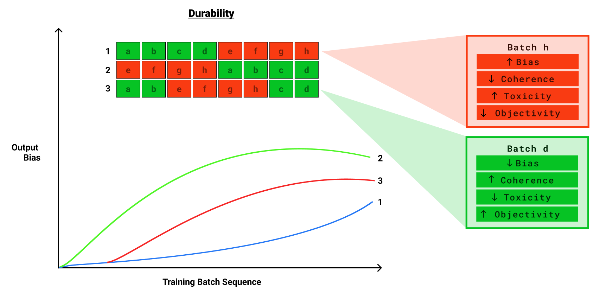
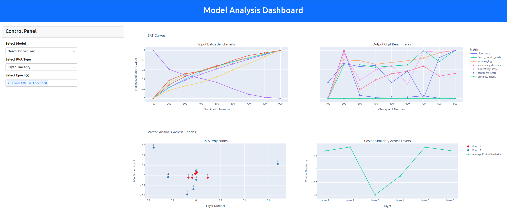

<!-- exclude_docs -->
[](./LICENSE.txt)
[](https://www.overleaf.com/project/654bbc7fcc22efd04a6c63f6)

<!-- exclude_docs_end -->


#  llama2_prebiasing

<!-- exclude_docs -->
> **⚗️ Status:** This project is still in *alpha*, and may change without warning.  
<!-- exclude_docs_end -->
<!-- include_docs
:::{important}
**Status:** This project is still in *alpha*, and the API may change without warning.  
:::
include_docs_end -->

<div align="center">

<!-- exclude_docs -->

<!-- exclude_docs_end -->
<!-- include_docs

include_docs_end -->

</div>


## 📃 Overview
The current machine learning paradigm heavily relies on a pretraining-followed-by-fine-tuning strategy. ***llama2_prebiasing*** aims to critically assess this strategy by exploring its underlying principles and effectiveness.

### Objectives
The project is driven by two main considerations:

#### 1. Saturation Curves
- **Goal 1:** Investigate the occurrence of saturation, where a model, given all information in the world and a small set of tasks, ceases to show significant improvement. This goal seeks to understand how saturation relates to the model architecture, the nature of data, and task specificity.
- **Goal 2:** Analyze the model's performance across various training checkpoints and data inputs pre- and post-saturation. This goal aims to compare performance metrics and losses versus the data used, to understand different models' tendencies and learning behaviors.

#### 2. Durability
- **Goal 1:** Examine the malleability of fundamental structures (such as embeddings and attention mechanisms) within models, which is not uniform throughout training and across different architectures. This involves demonstrating these aspects in the context of ordered batch sampling using batch metadata.
- **Goal 2:** Explore the effects of fine-tuning (FT) models at different stages of training, sensitivity to labels, and overt-> covert bias. This includes controlling for losses and performance metrics to understand the model's ability to remove biases or improve performance.
<div align="center">

<!-- exclude_docs -->


<!-- exclude_docs_end -->
<!-- include_docs


include_docs_end -->

</div>
<br>

### Outcomes
* **🌐 Training with Peripheral vision:** Method for evaluating data used and model performance, detecting covert attributes, throughout LM training- real-time or post-hoc at checkpoint level (on HF?).
* **📊 Fine-tuning Fragility:** Analysis of model flexibility to new information, ICL, OOD, debiasing throughout training and during fine-tuning
* **🔍 Bias-aware Training:** Tools for Data and Model card integration with respect to LLMs before and after fine-tuning.

#### ***Timeline = ACL 2024 deadline = February***

<br>
<br>

# Workpackages
## 1. Tinystories  

### a. Download Dataset 

First we download tinystories dataset. 

```bash
python download/download_datasets.py tinystories
```

This creates a new folder called data in the root directory that contains 'TinyStories_all_data'.

### b. Tokenize and Evaluate Batches

We then tokenize the dataset using sentencepiece tokenizer model.
This creates a .bin file in the data/TinyStories_all_data folder that contains the tokenized dataset.

```bash
python tokenization/pretokenize.py pretokenize
```

During this process each shard is tokenized and global ids are created


### c. Metadata
```bash
python metadata/batch_metadata.py compute_metadata
```
Here each sample is evaluated using metrics such as perplexity and sentence length. These are the same metrics as what is used in model evaluation in 3.

Batch metrics are stored in out/tables/batch_metrics.csv


## 2. Pretraining   |


```bash
python modelling/train.py
```
The Modelling folder contains the model configurations, training loop, and dataset class. It also contains the custom sampler and transformation functions that allow modification of the batch order.

During training checkpoint files contain embeddings, attention weights, and batches used to that point, and the model folder contains the bin files. These are all store in the out folder.


## 3. Model Evaluation   |
There are three main scripts for checkpoint evaluation:

#### a. Attention Visualization
```bash
python visualize_attn.py
```

These take the stored attention weights from each checkpoint and plot the attention weights for each layer and head.

All plots from this section are stored in the model specific out dir/visualize

### b. Embedding Visualization
```bash
python visualize_embd.py
```

This takes the stored embeddings from each checkpoint and plots the embeddings using PCA.


### c. input/output Evaluation
```bash
python eval.py
```
To evaluate the output this loads the model and generates a sequence of 200 tokens. It then compares the generated sequence to the expected sequence and other metrics such as sentance length and outputs the results to a csv file in out/tables.

For the batch metrics, these metrics were already calculated in stage 1b. This script just loads the table and adds the batch metrics of those batches used at a given checkpoint to a summary table.


### d. Saturation curves
```bash
python visualize_sat_curves.py
```
This script takes the batch metadata (1c) and the model ouput metadata (3c) and plots the metrics for each checkpoint next to each other. This allows for easy comparison of the metrics of model inputs and outputs

## 4. Experiments   |

### a. Durability
```bash
python experiments/durability/experiment_durability.py
```

This script takes the model input metadata (1c) and sorts the batches by a given metric. It then trains the model on the sorted batches and evaluates the model output (3c). 

Saturation curves are then plotted for each metric and compared to the saturation curves of the unsorted model. Comparisons across time as well as the end points are made to see if the same data in different orders has different effects on the end model.


## 5. Dashboard   |
``` bash
python dash_llama/app.py
```

<div align="center">

<!-- exclude_docs -->

<!-- exclude_docs_end -->
<!-- include_docs

include_docs_end -->

</div>

<br>
<br>

# Planned Work 

| Feature | Description |
| ------- | ----------- |
| Input Analysis | Implementing a range of metrics for model evaluation: <br> - [Toxic Flags](https://github.com/LDNOOBW/List-of-Dirty-Naughty-Obscene-and-Otherwise-Bad-Words) <br> - Co-occurrence from Danes <br>-  Steroset <br> - CEAT <br> - ILPS <br> - Logits |
| Output Analysis | Improved metrics for checkpoint evaluation: <br> - [Task Transferability in Large-Scale Multi-Task Learning](https://arxiv.org/abs/2204.11117) <br> - [ICL vs Instruction](https://github.com/Alrope123/rethinking-demonstrations) <br> - Additional downstream task performance e.g. HATEX, TOXD, BOLD,  |
| Fine Tuning Effects | Deliberate FT on Task specific datasets e.g. <br> - [Upstream Mitigation Is Not All You Need](https://aclanthology.org/2022.acl-long.247/) <br> -[Overwriting Pretrained Bias with Finetuning Data](https://arxiv.org/abs/2303.06167) |
| Dataset Expansion | - Path 1 = Extending training to include larger datasets such as arXiv and Wikipedia -> show  LLaMA bias on RedPajama <br> Path 2= Specific use case e.g. more advanced version of [politics](https://arxiv.org/abs/2305.08283) <br> Path 3= Checkpoints and data available e.g. BLOOM|
| Dynamic Batch Sampling | Utilizing model output metrics at each checkpoint to update the probability of batch selection for subsequent training epochs, REALM/supervised pretraining. |
| Universal IDs for Resources | Implementing universal identifiers for dataset cards and model cards online to streamline resource management and accessibility. |
| Precursor to MedPaLM eval | - Google agreed to give us checkpoints for PaLM and MedPaLM for evaluation<br> - This project will be proof of methods that we want to evaluate checkpoints with <br> - Need to convince that we need data too|

## ✍️ Citing
***Deadline: February 2023***
The current manuscript is available on [Overleaf](https://www.overleaf.com/project/654bbc7fcc22efd04a6c63f6). 


